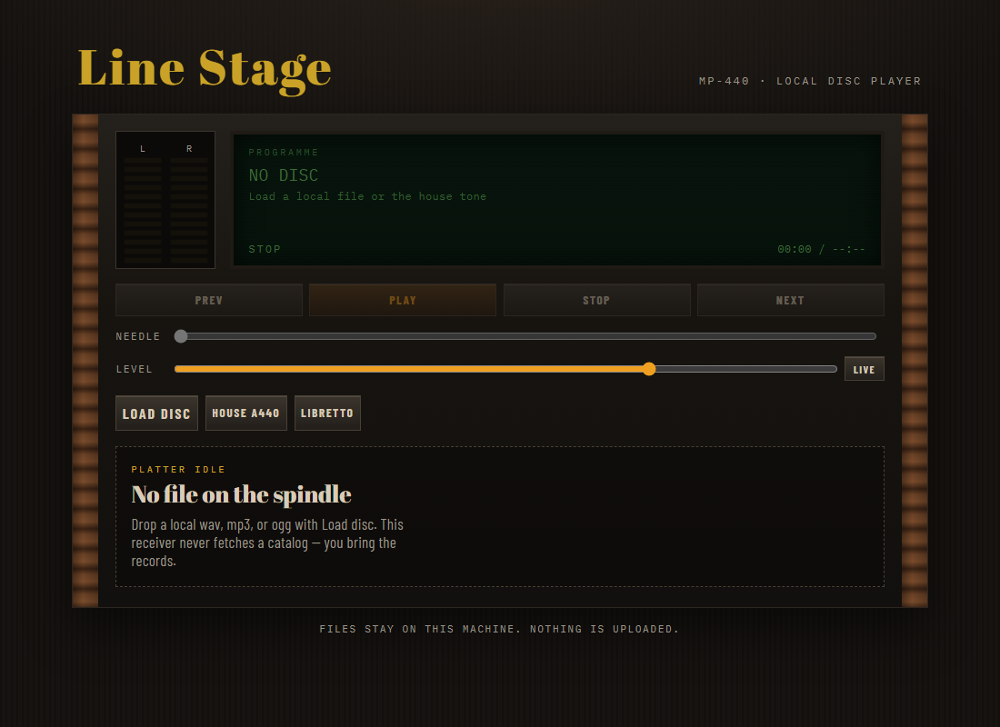

# music-player

Local-file hi-fi for the browser. Cue wav/mp3/ogg from disk, run a tape stack, optional libretto panel. Nothing leaves the machine.

## Run

```bash
npm install
npm run dev
```

Open the printed URL. You should see a walnut-and-brass receiver with an empty platter (`NO DISC`). Use **Load disc** for your own audio, or **House A440** for a two-second generated tuning tone in `public/tuning-tone.wav` (original sine, not a licensed track).

```bash
npm run build
npm run preview
```

## Layout of the code

- `src/domain` — track, queue, player, lyrics types and pure helpers
- `src/data` — file ingest, object URLs, volume/lyrics prefs
- `src/ui` — receiver chrome, transport, queue, empty/fault, libretto

## Screenshot


